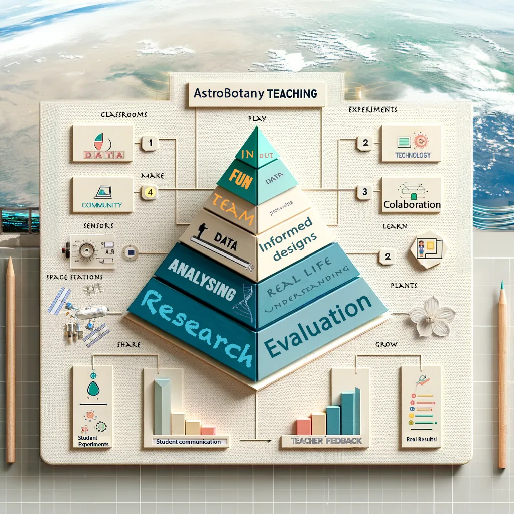

# 🌱🚀 Astrobotany & Space Biology (AIR)

Welcome to the **AstroBotany Investigation Resource (AIR)** — a holistic, research-intensive undergraduate track combining space biology, automated phenotyping, computational systems modeling, and spaceflight bioinformatics.

Over a cohesive **12-week program**, students progress from basic plant cultivation and scientific imaging to advanced simulated-microgravity assays on Random Positioning Machines (RPMs), multicellular auxin transport simulations, and mining actual NASA spaceflight transcriptomics datasets (RNA-seq).

<figure markdown="span">
  { width="640" }
  <figcaption>The AIR Undergraduate Track blends biology, data science, hardware engineering, and space exploration.</figcaption>
</figure>

---

## 🎯 Course Navigation & Quick Links

Start your astrobotany journey by exploring the core program planning materials:

-   :material-school:{ .lg .middle } __Track Overview__

    ---

    Explore program objectives, core competencies, and required equipment.

    [:octicons-arrow-right-24: Course Overview](undergrad/README.md)

-   :material-book-open-variant:{ .lg .middle } __Course Syllabus__

    ---

    Review learning outcomes, weekly expectations, grading policies, and evaluation rubrics.

    [:octicons-arrow-right-24: Review Syllabus](undergrad/SYLLABUS.md)

-   :material-calendar-month:{ .lg .middle } __Weekly Schedule__

    ---

    Step-by-step 12-week calendar mapping readings, laboratory exercises, and deliverables.

    [:octicons-arrow-right-24: Weekly Schedule](undergrad/SCHEDULE.md)

-   :material-github:{ .lg .middle } __Open & FAIR Science__

    ---

    Contribute to worldwide open-science initiatives using standardized databases and sharing guides.

    [:octicons-arrow-right-24: Reference & Tools](tools.md)

---

## 🗺️ The 11 Program Stages of the Undergraduate Track

Students will progress sequentially through 11 research stages, bridging macroscopic observations with microscopic transcriptomics and computational models:

### Unit 1: Foundations of Phenotyping (Weeks 1–2)
*   **Stage I — Scientific Photography**: Learn to capture clear, repeatable, and calibrated plant photographs using standardized scale bars (the AstroBotany Spectrum) for automated computer-vision measurements.
*   **Stage II — Favorite Microgreen**: Explore nutrition and crop yield datasets to inform crop selection and understand the data-driven science of space agricultural diets.
*   **Stage III — Growing Microgreens**: Cultivate microgreens in terrestrial growth media and perform daily photography to analyze canopy coverage and **Green Area Index (GAI)** via **PlantCV**.

### Unit 2: Tropisms & Simulated Microgravity (Weeks 3–4 & 7–8)
*   **Stage IV — Gravity & Roots**: Grow roots vertically on plant-based agar plates, then rotate plates 90° to document and analyze root gravitropic reorientation kinetics.
*   **Stage V — Auxin & Plant Cloning**: Explore plant hormone dynamics by inducing cell dedifferentiation and initiating plant stem cell (callus) cultures.
*   **Stage VI — Micro-Gravi-tropism Assays**: Execute advanced, quantitative multi-hour gravitropic assays on shoots and roots under vertical conditions and simulated microgravity.

### Unit 3: Computational Modeling & Spaceflight Omics (Weeks 5–6 & 9)
*   **Stage VII — Hormone Transport Modelling**: Run multicellular computational simulations of membrane-bound transporter proteins to predict cellular auxin transport gradients.
*   **Stage VIII — Root Modelling**: Simulate root hydraulic architecture, water movement, and localized hydropatterning under varied moisture vectors.
*   **Stage IX — Plant Modelling**: Model whole-plant developmental architecture and photosynthetic yields under simulated closed-loop life-support constraints.
*   **Stage X — Mining RNA-seq**: Query the NASA Open Science Data Repository (OSDR) / GeneLab to analyze actual spaceflight transcriptomics datasets and model metabolic adaptations to microgravity.
*   **Stage XI — Membrane Interactome**: Map membrane-bound receptor and transport interactome networks to investigate environmental sensing pathways.

---

## 🔬 Why this is Real Science

AIR utilizes an **open, FAIR** approach (*Findable, Accessible, Interoperable, and Reusable*). All data shared by students to standardized platforms such as [Epicollect5](https://five.epicollect.net/) adheres to unified research standards. Everything on this site is released in the public domain ([CC0 1.0](https://creativecommons.org/publicdomain/zero/1.0/)), allowing classrooms, research groups, and space biology enthusiasts worldwide to freely utilize, remix, and translate these resources.

---

*A program of the SKG Astrobotany Research and Education Program (Osaka, Japan) and the Gilroy Lab, University of Wisconsin–Madison. Developed by Gilbert Cauthorn, Sophia Griffith, Rachel Wang, and Dr. Richard Barker.*
